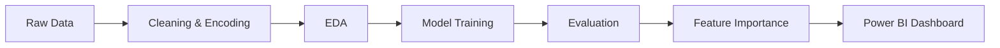

# Customer Churn Prediction for Subscription Services
In subscription-based businesses, retaining customers is crucial for sustainable growth. This project aims to analyze customer behavior, service usage patterns, and demographic factors to predict which customers are at risk of churning. By leveraging machine learning techniques, the model helps identify potential churners early, enabling targeted retention strategies, reducing revenue loss, and improving overall customer satisfaction.

## Business Problem
Subscription-based companies often face customer churn — the loss of customers over time.  
The marketing team currently uses a blanket retention approach, leading to unnecessary discounts for loyal customers and missed opportunities to retain at-risk users.

**Goal:** Build a predictive model to identify customers likely to churn so the company can focus retention efforts effectively.

## Business Objectives
1. Analyze customer demographics and service usage to identify churn drivers.  
2. Develop a predictive model to classify customers as "Churn" or "Non-Churn".  
3. Determine key factors influencing churn.  
4. Visualize results for business decision-making.

##  Dataset Overview
**Source:** [Kaggle – Telco Customer Churn Dataset](https://www.kaggle.com/blastchar/telco-customer-churn)  
**Rows:** ~7,000  
**Target Variable:** `Churn` (Yes/No)

| Feature | Description |
|----------|-------------|
| Tenure | Number of months customer stayed |
| MonthlyCharges | Monthly amount billed |
| TotalCharges | Lifetime total billed |
| Contract | Contract type (Month-to-Month / One-Year / Two-Year) |
| PaymentMethod | Payment method type |

## Data Cleaning & Preprocessing
- Converted `TotalCharges` to numeric and filled missing values.  
- Encoded categorical variables using LabelEncoder.  
- Created `AvgMonthlySpend = TotalCharges / (Tenure + 1)`.  
- Scaled numeric features using `StandardScaler`.

## Workflow

## Modeling & evaluation:
 
| Model | Accuracy | Recall | Precision | F1 | ROC-AUC |
|--------|-----------|----------|------------|-----------|---------|
| Logistic Regression | 0.74 | 0.79 | 0.51 | 0.61 | 0.84 |
| Random Forest | 0.78 | 0.50 | 0.62 | 0.55 | 0.82 |
| Gradient Boosting | 0.79 | 0.49 | 0.65 | 0.56 | 0.83 |
| RF + SMOTE | 0.76 | 0.74 | 0.53 | 0.62 | 0.84 |

## Power BI Dashboard Highlights

* Churn rate by contract type

* Payment method vs churn

* Monthly revenue vs tenure

* Feature importance summary

## Key Business Insights

* Month-to-month customers are 3x more likely to churn.

* Electronic check payments have highest churn correlation.

* Long-term contracts improve retention by ~15%.
  
* Targeted offers can reduce churn by 10–15%.

## Tech Stack

Python | pandas | numpy | scikit-learn | seaborn | matplotlib | Power BI

## Business Analytics Extension

* RFM segmentation for customer value tiers.

* Funnel analysis of churn stages.

* KPI cards for retention and revenue loss.

 ## Conclusion

The model provides actionable churn predictions, enabling marketing teams to target high-risk customers effectively and increase retention.
